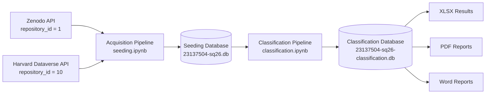

# 📘 SeedingQDArchive: Automated Pipeline for Harvesting and Classifying Qualitative Research Datasets

**Student:** Shubhangi More (23137504)  
**Course:** Applied Software Engineering Seminar/Project — Open-Source Software  
**University:** FAU Erlangen-Nürnberg

### Repositories
- **Zenodo** (`repository_id = 1`)
- **Harvard Dataverse** (`repository_id = 10`)

---

# 🌍 1. Introduction

QDArchive is an end-to-end pipeline designed to identify, retrieve, classify, and semantically organize **qualitative research datasets** from open repositories.

The pipeline automatically harvests metadata and files from public repositories, identifies qualitative research projects, classifies them using the **ISIC Rev.5 taxonomy**, and generates structured databases and analytical reports.

## Pipeline Overview



The pipeline operates in **two distinct phases**.

## Phase 1 — Acquisition

Harvests datasets from:

- Zenodo
- Harvard Dataverse

The acquisition step identifies qualitative research project files including:

- NVivo
- ATLAS.ti
- MAXQDA
- REFI-QDA
- Transana
- Quirkos

It also detects primary research data such as:

- Interview transcripts
- Documents
- PDFs
- Audio
- Video
- Images

using each repository's public API.

---

## Phase 2 — Classification

Projects are semantically mapped to the **ISIC Rev.5 (International Standard Industrial Classification)** taxonomy (Division level) using sentence-transformer embeddings.

This provides automated thematic organization according to economic activity.

---

The pipeline maintains a structured SQLite database consisting of:

- `projects`
- `files`
- `file_classification`
- `keywords`
- `person_role`
- `licenses`

This enables reproducible research and downstream discovery.

---

# 🧠 2. Data Acquisition Logic

Every discovered dataset is evaluated automatically and assigned one of the following project types.

| Project Type | Description |
|--------------|-------------|
| **QDA_PROJECT** | Native qualitative-analysis project detected (.qdpx, .nvp, .mx24, .atlproj, .qde, etc.) |
| **QD_PROJECT** | No QDA project found, but primary research files are present |
| **OTHER_PROJECT** | Files exist but do not match QDA or primary-data extensions |
| **NOT_A_PROJECT** | No meaningful project files detected |

---

## Metadata Captured

For every harvested dataset the pipeline stores:

- Title
- Description
- Language
- DOI
- Upload date
- Authors / Creators
- Keywords
- License identifiers

This metadata supports:

- semantic classification
- future reuse
- reproducibility

---

## Download Strategy

Download requests include:

- exponential backoff retry
- automatic retry on server errors

No deliberate inter-request throttling is currently implemented.

---

# 🏷️ 3. Data Classification Logic

Once projects are typed, they are semantically classified.

## Taxonomic Reference Mapping

ISIC Rev.5 division labels are embedded as semantic reference vectors.

Since division names are often very short (e.g. *Human health activities*), each label is enriched with additional topical keywords before embedding.

---

## Semantic Similarity Matching

Each project combines:

- title
- first ~120 words of description
- keywords

into a single text block.

The text is embedded using

```
paraphrase-MiniLM-L3-v2
```

and compared against ISIC divisions using cosine similarity.

The pipeline stores:

- `primary_class`
- `secondary_class`

---

## Hierarchical Propagation

Every primary data file is also classified individually.

Results are stored in:

```
file_classification
```

This prevents multi-file projects from being reduced to a single topic.

---

## Project Types Classified

Both project types undergo identical classification:

- `QDA_PROJECT`
- `QD_PROJECT`

Repository information (`repository_id`) is preserved throughout the pipeline.

---

# 🖥️ 4. Running the Pipeline

The project consists of two Jupyter notebooks.

---

## Part 1 — Harvesting & Database Seeding

Run:

```
23137504-seeding.ipynb
```

Requirements:

- Internet connection
- Zenodo API
- Harvard Dataverse API

Output:

```
23137504-sq26.db
```

---

## Part 2 — Semantic Classification & Report Generation

Run:

```
23137504-classification.ipynb
```

Requirements:

- sentence-transformers
- First run downloads:
  `paraphrase-MiniLM-L3-v2`

Outputs:

```
23137504-sq26-classification.db
23137504-sq26-classification-results.xlsx
PDF reports (one per repository)
```

The generated PDF reports include:

- histograms
- ranked classification tables
- comments on findings

---

# 📊 5. Classification Confidence

Each assigned `primary_class` includes a cosine similarity score.

This is currently the pipeline's only quality metric.

No measurements are currently implemented for:

- stability
- coherence
- multilingual consistency

---

## Current Results

| Repository | Classified Projects | Average Similarity |
|------------|-------------------:|-------------------:|
| Zenodo | 22 | **0.266** |
| Harvard Dataverse | 196 | **0.274** |

Course reference range:

```
0.755 – 0.843
```

Projects with similarity scores below **0.20** are marked as **Low Confidence**.

They are highlighted in:

- XLSX (`confidence` column)
- PDF report comments

These classifications should be considered provisional.

---

# 🗃️ 6. Data Sources & Citation

## Zenodo

Datasets are harvested using the Zenodo REST API.

API

```
https://zenodo.org/api/records
```

Citation

> Zenodo (CERN). *Zenodo Research Data Repository.* Available at https://zenodo.org

---

## Harvard Dataverse

Datasets are harvested using the Harvard Dataverse API.

API

```
https://dataverse.harvard.edu/api
```

Citation

> Harvard Dataverse. *Harvard Dataverse Repository.* Available at https://dataverse.harvard.edu

---

## Dataset-Level Citation

Each harvested dataset retains:

- DOI
- Authors
- Creators
- License

These are preserved in the SQLite database and should be cited individually using each repository's recommended citation format.

---

# ⚖️ 7. Ethical & Legal Considerations

- Only publicly accessible records are harvested.
- Original license identifiers are preserved in the `licenses` table.
- The project records license information but does not independently verify license compliance.
- Failed requests use exponential backoff retry.
- No deliberate request throttling is implemented.

---

# 🙏 Acknowledgments

Special thanks to **Prof. Dr. Dirk Riehle, M.B.A.** for the project brief and guidance throughout both phases of the Seeding QDArchive seminar project:

- Part 1 — Acquisition
- Part 2 — Classification
